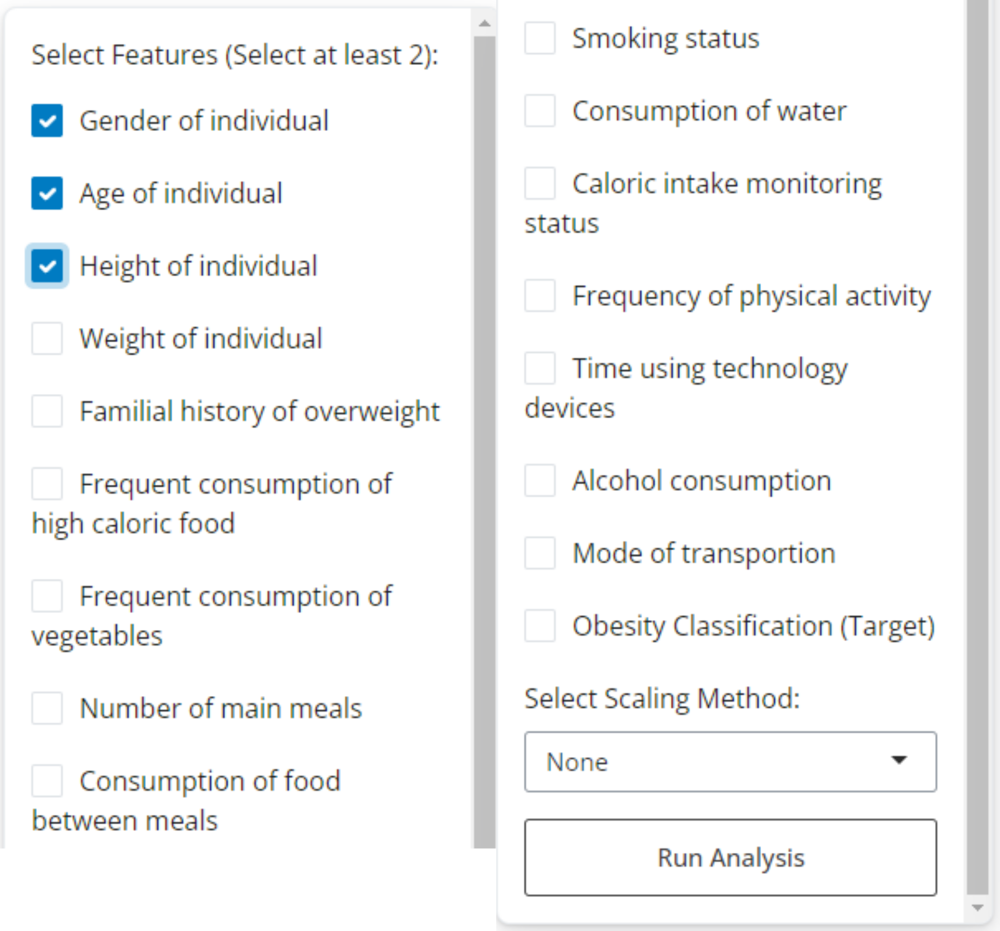
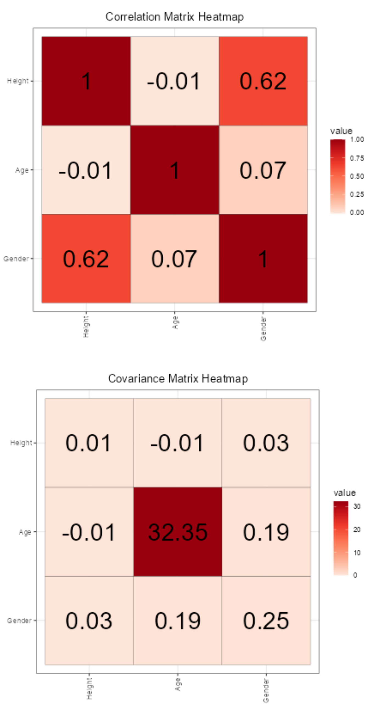
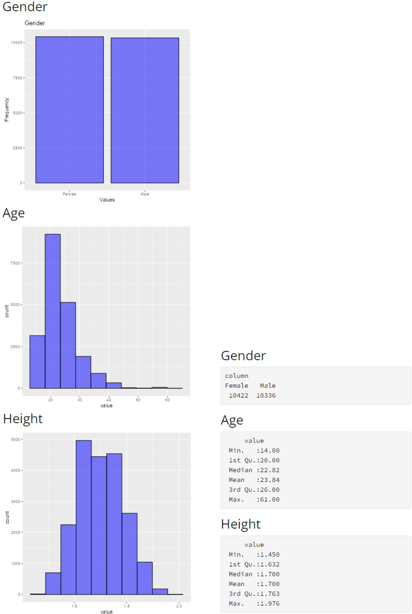
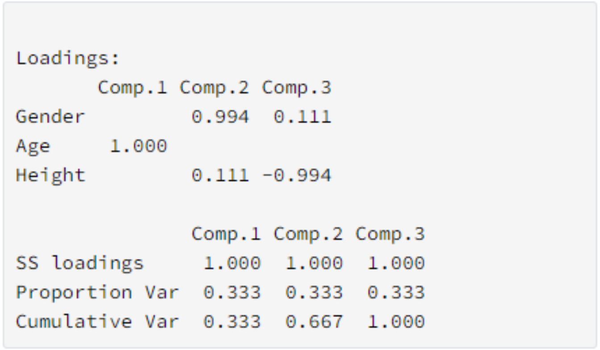
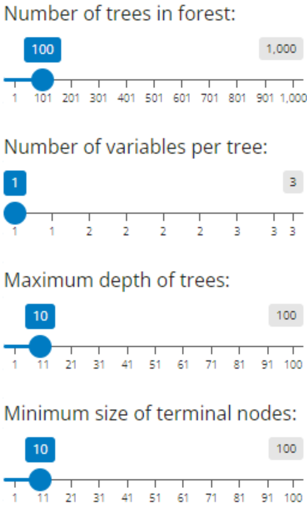
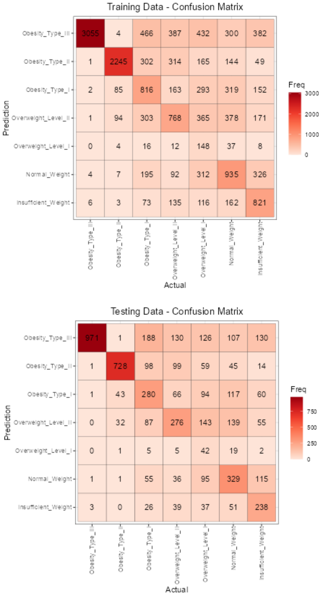
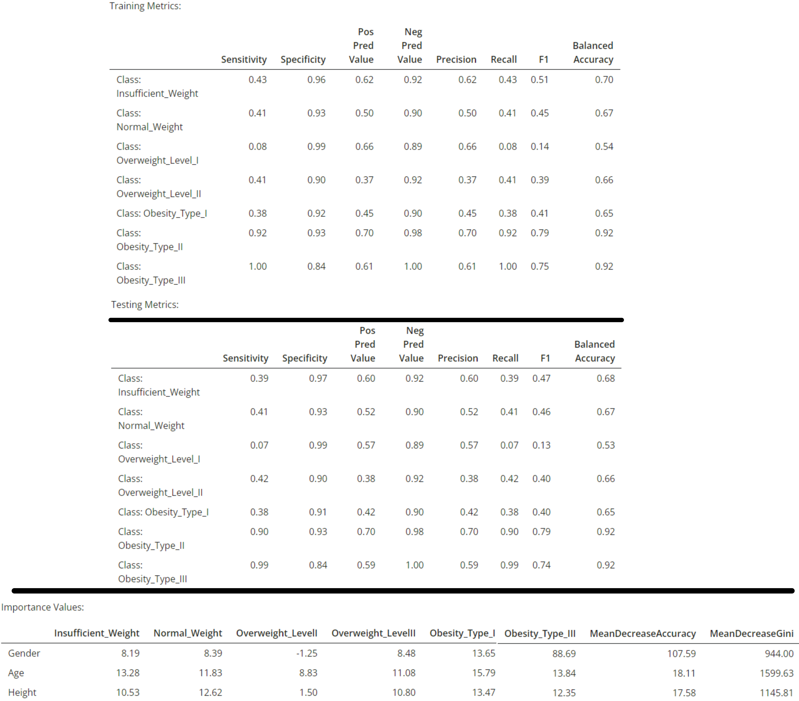

```{r, include = FALSE}
knitr::opts_chunk$set(
  collapse = TRUE,
  comment = "#>"
)
```

```{r setup}
library(Project3Caba0009)
```

# Introduction
For this project we were tasked with developing a shiny app that carried out some form of data analysis. However, as the project was open ended, we took a slightly different approach than our typical projects/assignments for this semester. Shiny apps are great way to visualize data and results so there was a significant emphasis on developing a viable dashboard for the analysis we undertook. Further, while we focused much of our effort on the fundamentals of multivariate statistics, current statistical methods often take advantage of machine learning algorithms to carry out data analysis on large, complex data sets. Therefore, as another aspect of this project, we opted to develop a random forest classifier model with an interactive dashboard in order to help the audience understand the impacts of parameter selection and feature engineering in machine learning models.

# Problem
Machine learning algorithms are often difficult for those unfamiliar with data science to learn at first due to their black box and relatively confusing nature. While there are many walk through notebooks available, there are not very many great interactive applications for exploring the different aspects of machine learning models. Therefore, it seemed beneficial to build an interactive dashboard that would help a beginning data science user to learn some of the basics.

# Dataset
The example data set we will be using comes from kaggle.com (https://www.kaggle.com/competitions/playground-series-s4e2/overview). It contains demographic data, e.g., gender, age, weight, height, eating habits, etc., with 17 input features and 1 target feature, obesity classification. The features included binary, categorical, and numerical data. The binary and categorical data was translated to numerical definitions to improve the efficacy of the model. There were 20758 rows of data in the total data set. For training and evaluation of the model the data was split into training and testing subsets at 75% and 25% of the overall data, respectively. Scaling was applied prior to the train/test split as determined by the user. Please see a preview of the data below.

```{r, echo=FALSE}
head(OR_Train)
```

# Random Forest Classifier
The random forest classifier is a very popular machine learning model which performs well, especially with dissimilar features such as those present in our data set. This classifier is composed of a discrete number of decision trees using a bagging technique, also known as bootstrap aggregation. This aids in reducing the impact of any one single tree which can help in reducing outlier influence.

## Decision Tree Theory
The main splitting criteria in this random forest implementation is the Gini Impurity (uncertainty). This equation is defined below $$Gini(S) = 1 - \Sigma^{c}_{i=1}p^2_i$$

with $S$ as the data set, $c$ as the the number of classes, $p_i$ as the proportion of instances in class $i$.

The other model mechanisms are controlled by the model hyperparameters as described in the next section.

## Hyperparameters
While a random forest model incorporates a vast number of hyperparameters, to simplify our discussion and the user experience only the four most influential were selected for inclusion and user augmentation. The first is $ntree$ which determines the number of decision trees in the forest. Typically, the more the merrier in this department, however, more trees does increase the computational cost. Increasing the number of trees can be especially helpful when the model is overfitting (i.e., it performs significantly better on the training data than the testing data). The second is $mtry$. This hyperparameter controls how many features are used in each decision tree. Increasing this hyperparameter increases the compuatational load as well, but a value that is too low (e.g., 1, 2, or 3) will result in underfitting as the model does not effectively comprehend the totality of the feature set. The third hyperparamater is $max_depth$. This hyperparameter controls the depth of the decision trees or the number of layers they can form before stopping and returning results. Increasing $max_depth$ can help the model fit better to a point, but increasing the value too high generally leads to overfitting and poor generalization. The last hyperparameter, $nodesize$, limits the minimum entries that must be placed on a node following a split. Therefore, each node has to hold at least $nodesize$ entries/individuals from the data set. Increasing this value can reduce overfitting and improve generalization, but if increased too far will lead to potential underfitting.

# Shiny App 
**Note: This app was constructed to be optimally viewed in a maximized window.**

## Overview
The developed shiny app can be called with the shinyplots() function. There are two dashboards within the application. The first we will discuss is the 'Feature Analysis' dashboard including the relevant function and features. Then, we will move into a discussion of the 'Construct Model' dashboard.

## User Interface
The two different dashboards were created using the nav_panel() function from the bslib library which works in conjunction with the shiny library for formatting shiny apps. Each vertical group/box is implemented by using separate card() objects inside of a layout_columns() object. The checkboxes, sliders, dropdown menu, and action buttons for the input panel card() object (left side of screen) on both pages allow the use to interact with the underlying functions. The action buttons are purposefully deactivated after being clicked until the function has finished running to prevent the user from overloading the application with function calls.


## Analyze Features
The *Analyze Features* dashboard aims to aid the user in performing beneficial feature engineering prior to constructing the random forest classifier. This dashboard performs 4 key analyses on selected features: determine the correlation matrix, determine the covariance matrix, summary statistics and distributions, and a PCA analysis.

### Input Panel
The input panel allows the user to select the features which they wish to analyze as well as implement a desired scaling scheme. Please refer to the image directly below for the discussion of each aspect and how it was implemented.

```{r, echo=FALSE, out.width='50%', fig.align='center'}

```

The check boxes allow the user to choose specific features (note that at least two must be chosen) to include in the analysis. The 'Select Scaling Method:' dropdown menu allows the user to choose a scaling method: Min-Max, Standardization (Z values), or Robust Scaling. The *Run Analysis* action button calls the Feat_Anal() function with the provided features and scaling method. It becomes deactivated until the function call has been completed to keep the client RStudio from overloading.

### Feature Covariance and Correlation
This card() object contains the Feat_Anal() function results of the covariance and correlation matrix. These are calculated using the selected features and scaling method selected by the user. Please see the example results below.

```{r, echo=FALSE, out.width='50%', fig.align='center'}

```

### Feature Summary Statistics
This card contains histograms for numerical data and bar plots for categorical data to help the user understand the underlying distribution. The summary statistical information is also provided below the plots for each feature selected. Scaling is applied to both the plots and the summary statistics as determined by the user as shown below.

```{r, echo=FALSE, out.width='100%', fig.align='center'}

```

### PCA Analysis
This analysis is included to help the user determine which features may be thoroughly described by other features to limit the amount of overlap in the features selected for the random forest model.

```{r, echo=FALSE, out.width='40%', fig.align='center'}

```

## Construct Model
The *Construct Model* dashboard aids the user in constructing a random forest classifier model. It allows the user to select specific features to include, the scaling method to use (same options as above), and adjust model hyperparameters.

### Input Panel
The input panel is constructed similarly to the *Analyze Features* input panel.The only difference is the inclusion of slider inputs for the model hyperparameters as shown below. Please the *Random Forest Classifier* section for an explanation of the hyperparameters. The action button maintains the same functionality in deactivating and reactivating as described for the *Analyze Features* input panel.

```{r, echo=FALSE, out.width='25%', fig.align='center'}

```

### Confusion Matrices
Confusion matrices were generated for the results of the model predictions on both the training and testing data set. The classifications of the target feature are shown on both the X and Y axis. The matrix heat maps are color coded with a the darker reds representing higher counts and the lighter reds representing lower counts. Please see the example below for reference.

```{r, echo=FALSE, out.width='50%', fig.align='center'}

```

### Model Metrics
This section included quantitative metrics for the model. They are derived using the 'caret' library. Metrics are provided for the model predictive performance on the training and testing data sets. The importance values are also listed to help the user understand the influence each feature has on the model. See below for an example (albeit poor result) output.

```{r, echo=FALSE, out.width='100%', fig.align='center'}

```

# Conclusion
This project involved lots of self learning about creating shiny apps and developing useful and informative dashboards backed by complex functions. This has been by far the most complex project I have completed in R and believe I have benefited immensely in terms of future utilization of these tools from this experience. I now feel confident in not only working with and understanding the underlying mechanisms of multivariate data sets, but turning that knowledge into a developed project which will prove very helpful in the future.
